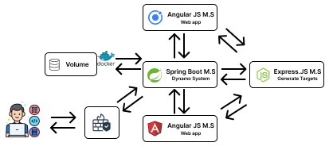

# SENNSE-AR Platform

An immersive **Augmented Reality (AR) platform** designed to enhance user experiences in **cultural heritage environments**.  
The platform leverages **microservices architecture** to deliver a modular, scalable, and efficient solution for exploring **microclimatic environments** through AR.

---

## 🚀 Objective

The main objective of this platform is to create an **immersive AR experience** by integrating advanced technologies such as:

- **Augmented Reality** (via [MindAR](https://hiukim.github.io/mind-ar-js-doc/)),
- **Microservices architecture** for modular and independent service scaling,
- **Parallelism and multithreading** to improve responsiveness and performance.

---

## 🏗️ Architecture Overview

The platform is composed of **four main microservices**, each with its own responsibility and lifecycle.  

### 1. **Dynamo System (Spring Boot Microservice)**
- Acts as the **core engine** of the platform.  
- Handles **user commands** from multiple frontend interfaces.  
- Built with **Spring Boot** for reliability and performance.  
- Uses **parallelism and event-driven threads** for handling tasks.  
- Initially stored data locally in JSON files → now extended to use **persistent storage** to avoid data loss in **Dockerized environments**.

---

### 2. **Target Generator (Express.js Microservice)**
- Built on **Node.js + Express.js**.  
- Integrates with **MindAR** open-source AR library.  
- Responsible for generating **target files** (used for image tracking in AR).  
- Supports popular ML frameworks such as **TensorFlow**, **Keras**, and others (via JavaScript ecosystem).  
- Works closely with the **Spring Boot microservice**, receiving requests (e.g., QR code generation tasks).  

---

### 3. **Web Interface (Angular Frontend)**
- Provides a **browser-based UI** for exploring AR content.  
- Developed with **Angular**, offering a structured and scalable frontend solution.  
- Communicates with backend services to render **real-time AR experiences**.  

---

### 4. **Mobile Application (Ionic Framework)**
- Provides a **mobile-first AR experience**.  
- Built with **Ionic**, which extends Angular for mobile application development.  
- Ensures cross-platform availability (Android & iOS).  

---

## 🖼️ System Architecture

  

## 🔑 Key Features
- Immersive AR Exploration for cultural heritage sites.
- Microservices-driven design → scalable, modular, and easy to extend.
- Docker-ready deployment pipeline.
- Event-driven parallelism for efficient command execution.
- Cross-platform availability (Web + Mobile).
- QR Code & AR Target Generation powered by MindAR.

## 📂 Repository Structure

Each microservice and frontend application is hosted as a separate sub-repository:
- `SENNSE-AR-MS-SB` → Spring Boot microservice (core engine).
- `sennse-target-generator` → Node.js/Express.js service for AR target generation.
- `SENNSE-AR` → Angular-based web application.
- `SENNSE-AR-Mobile` → Ionic-based mobile application.

## 🐳 Deployment
The entire system is containerized and orchestrated via Docker.
Persistent storage is configured to ensure data is not lost during container restarts or upgrades.

## 📖 Future Improvements
- Enhance persistent storage (migration from local JSON → cloud-native database).
- Add advanced ML-based AR features.
- Expand mobile app functionality for offline exploration.
- Integrate CI/CD pipeline for automated deployments.

## 🤝 Contribution
We welcome contributions!

To contribute:
1. Fork the repository.
2. Create a feature branch (`git checkout -b feature-name`).
3. Commit changes (`git commit -m 'Add feature'`).
4. Push to the branch (`git push origin feature-name`).
5. Open a Pull Request.